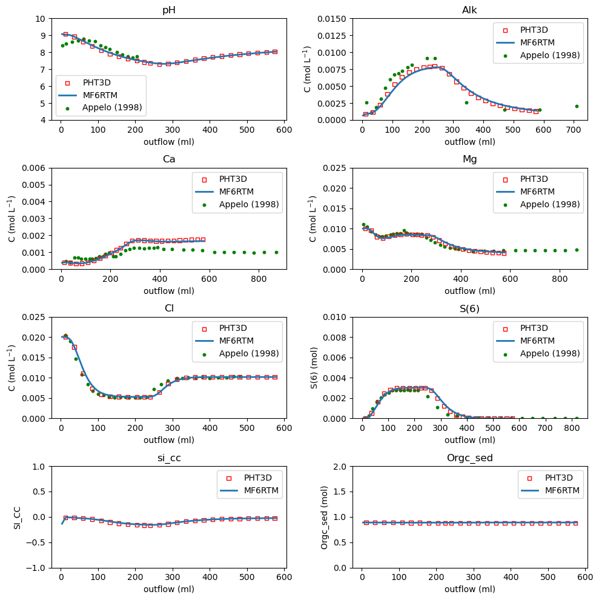

# Summary

Reactive transport modeling plays a central role in characterizing and predicting the coupled behavior of groundwater flow, solute transport, and geochemical reactions in subsurface systems [@Prommer2019]. This paper presents MF6RTM (MODFLOW 6 Reactive Transport Module), a Python package that tightly couples MODFLOW 6 [@Langevin2024], the current generation of the MODFLOW groundwater flow and transport code family, with PHREEQC [@Appelo2010], a widely used geochemical modeling engine. The coupling is achieved through the MODFLOWAPI [@Hughes2022] and PHREEQCRM [@Parkhurst2015] APIs, which use the Basic Model Interface (BMI) version 2.0 [@Hutton2020] to enable efficient and consistent data exchange between hydraulic, transport, and geochemical components during simulation.

The software provides a unified computational environment for simulating a wide range of reactive transport processes, including contaminant migration, mineral dissolution and precipitation, and redox transformations. It also supports the core features of both MODFLOW 6 and PHREEQC modeling software packages, allowing users to represent complex hydrogeological conditions and geochemical systems.

In addition, MF6RTM includes an improved input and output system that can externally write chemistry-related input files in array format. This behavior is similar to the external file workflow already present in MODFLOW 6 and provides flexibility for integration with uncertainty analysis tools such as PEST++ [@White2018] and its Python interface PyEMU [@White2016]. These capabilities support fully-scripted workflows such as uncertainty quantification, sensitivity analysis, and multi-objective optimization.

Together, these features make MF6RTM a versatile and robust framework for predictive reactive transport modeling in hydrogeological and environmental applications.


# Statement of Need

Several tools have coupled flow-and-transport simulators with geochemical engines or implemented fully integrated reactive transport solutions. A few actively developed open-source and standalone (implicitly coupled) reactive transport software systems are noteworthy, including CrunchFlow [@Steefel2014], PFLOTRAN [@Hammond2022], and OpenGeoSys [@Kolditz2012]. Other open-source software has explicitly coupled transport and reaction models, including PHAST [@Parkhurst2010], PHT3D [@Prommer2003], and eSTOMP [@Nieplocha2006]. For a more comprehensive overview, see the review by Steefel [@Steefel2015].

No software system, however, has ever coupled the current major versions of MODFLOW (v6 released in 2017) and PHREEQC (v3 released 2013). The MODFLOW family of codes remains one of the most widely used platforms for simulating flow and transport in real-world hydrogeologic applications for exploratory and predictive purposes among researchers and practitioners. Given the number of models and workflows built around MODFLOW, having a robust and modern reactive transport coupling is essential.

Previous couplings with PHREEQC have been developed for MODFLOW-2005/MT3DMS, known as PHT3D [@Prommer2003], and for MODFLOW-USG [@Panday2013], known as PHT-USG. PHT3D has seen extensive use in both academia and practice [@Appelo2010], while PHT-USG has gained traction more recently, particularly between practioners working with MODFLOW-USG. A key limitation of both approaches is that they require modification of the underlying source code to enable the coupling. This imposes a heavy maintenance burden and increases the risk of the code falling out of date. Indeed, both PHT3D and PHT-USG still rely on PHREEQC-2 and updating to the latest PHREEQC version 3 [@Parkhurst2013] through the PHREEQCRM library would require substantial refactoring. As MODFLOW 6 and PHREEQC continue to expand in capability and adoption, there is a clear need for a modern, open-source coupling that preserves transparency, extensibility, and computational efficiency.

MF6RTM addresses this need by providing a fully open, API-based integration between MODFLOW 6 and PHREEQC. This design eliminates custom file-based workflows, reduces opportunities for error, and enables users to construct complex reactive transport simulations directly in Python. With built-in compatibility with PEST++ and PyEMU, the tool also supports rigorous uncertainty analysis and multi-objective optimization. MF6RTM fills an important gap in the hydrogeologic modeling ecosystem by providing researchers and practitioners with an accessible, reliable, and high-performance MODFLOW-based framework for reactive transport modeling that can be fully scripted.


# Codebase

The codebase is organized into five modules, of which two, simulation and mup3d, serve as the core components.

The `simulation` module manages everything related to initializing, solving, and coordinating the interaction between MODFLOW 6 and PHREEQC3. The `mup3d` module (Model Utility Preprocessor 3D) focuses on providing users with a Python interface to help generating model input files, particularly those required for the geochemical components. Its role is similar to that of FloPy for MODFLOW [@Bakker2023].

The remaining modules provide supporting functionality: the `io` submodule handles reading and writing model files, while the `utils` and `config` modules assist in generating configuration files and managing the overall modeling workflow.

```
MF6RTM
├── mup3d
│   └── base.py
│
├── simulation
│   ├── solver.py
│   ├── mf6api.py
│   ├── phreeqcbmi.py
│   └── discretization.py
│
├── io
│    └── externalio.py
│
└── config/utils
    ├── config.py
    ├── utils.py
    └── yaml_reader.py
```


# Benchmark 

Six benchmark test cases are currently included in the codebase. Each represents a well-known reactive transport scenario to confirm the accuracy of results for different combinations of processes. Five of them correspond to models that apply different hydraulic fields and geochemical reaction networks, with results compared against PHT3D and in a few cases against PHREEQC. The sixth example is the same as Example 4 but uses the MODFLOW 6 discretization-by-vertices (DISV) package.

Here we present the following benchmark (Example 5 in codebase) to demonstrate usage and verify that the implementation is correct.
This benchmark models a 1D column oxidation experiment in marine sediments containing pyrite, originally described by Appelo et al. [@Appelo1998]. The hydrochemical system includes multiple coupled processes:

- **Pyrite oxidation**, the primary driver of hydrochemical evolution  
- **Secondary reactions**, including calcite dissolution, CO₂ sorption, and cation exchange  
- **Oxidation of organic matter**, which competes for the available oxidising capacity  

The model simulation consists of three sequential phases:

1. **Equilibration phase:** The sediment was saturated with a 280 mmol MgCl<sub>2</sub>  solution, filling the pore space and loading the exchange sites with Mg.  
2. **Dilute flushing phase:** The column was flushed with a more dilute MgCl<sub>2</sub> solution, providing data used to characterise non-reactive transport.  
3. **Oxidation phase:** The column was flushed for four pore volumes with an oxidising H<sub>2</sub>O<sub>2</sub> solution at the same flow rate. 

\autoref{fig:ex5} compares the MF6RTM simulation results with those from PHT3D and with the experimental data. The good agreement with PHT3D and the experimental data shows that MF6RTM accurately reproduces the benchmark behavior.

{width=100%}


# Acknowledgements

The software MF6RTM was supported by INTERA INC., and its Research and Development initiative. We also thank Henning Prommer for his insights and discussions during the benchmarking of MF6RTM.


# References