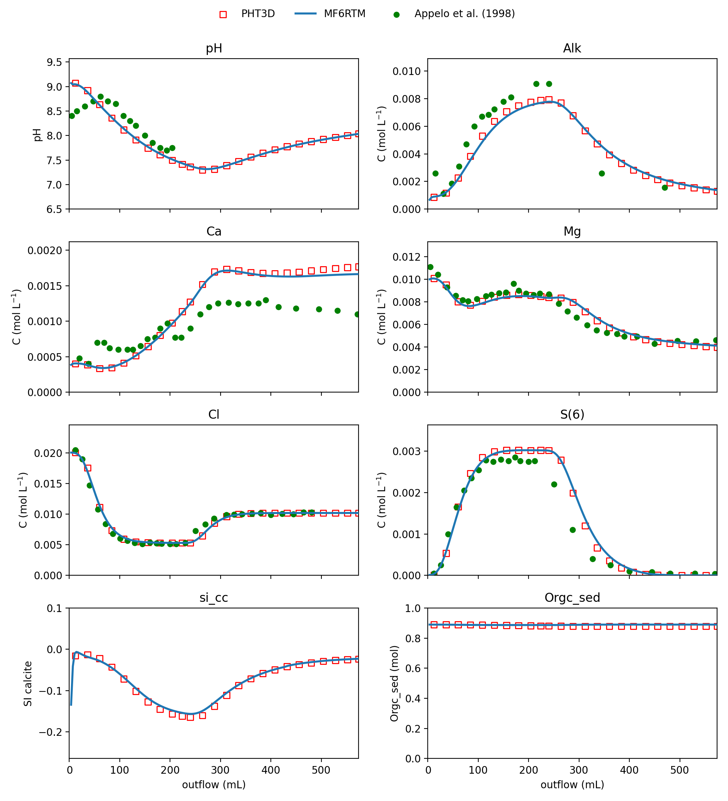

# Summary

Reactive transport modeling (RTM) plays a central role in characterizing and predicting the coupled behavior of groundwater flow, solute transport, and geochemical reactions in subsurface systems [@Prommer2019]. This paper presents MF6RTM (MODFLOW 6 Reactive Transport Module), a Python package that tightly couples MODFLOW 6 [@Langevin2024], the current generation of the MODFLOW groundwater flow and transport code family, with PHREEQC [@Parkhurst2013], a widely used geochemical modeling engine. The coupling is achieved through the MODFLOW API [@Hughes2022] and PhreeqcRM [@Parkhurst2015], which use the Basic Model Interface (BMI) version 2.0 [@Hutton2020] to enable efficient and consistent data exchange between hydraulic, transport, and geochemical components during simulation, without modifying the source code of either program.

The software provides a unified computational environment, accessible entirely from Python, for simulating a wide range of reactive transport processes, including contaminant migration, mineral dissolution and precipitation, and redox reactions. It supports the core features of both MODFLOW 6 and PHREEQC, two reference codes in groundwater and geochemical modeling, allowing users to represent complex hydrogeological conditions and geochemical systems and to add geochemical reactions to existing MODFLOW 6 models built with FloPy.

In addition, MF6RTM writes chemistry-related inputs as external array files, following the external file workflow of MODFLOW 6. Reactive transport models can therefore be parameterized with the same tools already used for flow models, such as PEST++ [@White2018] and its Python interface pyEMU [@White2016].

Together, these features make predictive reactive transport modeling accessible to the large community of MODFLOW users, allowing reactive transport models to be built, run, and calibrated within a single Python workflow, using the MODFLOW 6 and PEST++ tools already familiar to groundwater modelers.

# State of the Field

Actively developed open-source reactive transport codes include standalone, implicitly coupled simulators such as CrunchFlow [@Steefel2014], PFLOTRAN [@Hammond2022], and OpenGeoSys [@Kolditz2012], and codes that explicitly couple separate transport and reaction models, such as PHAST [@Parkhurst2010], PHT3D [@Prommer2003], and eSTOMP [@Nieplocha2006]. For a more comprehensive overview, see the review by @Steefel2015.

Previous PHREEQC couplings within the MODFLOW ecosystem include PHT3D for MODFLOW-2005 [@Prommer2003] and PHT-USG for MODFLOW-USG Transport [@Panday2020]. PHT3D has seen extensive use in both academia and practice [@Appelo2010], while PHT-USG has gained traction more recently, particularly among practitioners working with MODFLOW-USG. A key limitation of both approaches is that they require modification of the underlying source code to enable the coupling. This imposes a heavy maintenance burden and has effectively frozen these coupled systems to older software versions. Indeed, both PHT3D and the current PHT-USG release (built on USG-Transport 1.4.0) still rely on PHREEQC-2, and updating to the latest PHREEQC version 3 [@Parkhurst2013] through the PhreeqcRM library would require substantial refactoring. 

# Statement of Need

Despite the comprehensive ecosystem for reactive transport simulators, to our knowledge, no open-source software couples the current major versions of MODFLOW (v6 released in 2017) and PHREEQC (v3 released 2013). This gap is significant because the MODFLOW family remains the dominant platform for groundwater flow and transport modeling in regulatory, consulting, and applied research contexts. Existing integrated RTM codes generally require users to rebuild models in alternative frameworks, limiting their adoption for MODFLOW-based workflows. Moreover, as MODFLOW 6 and PHREEQC continue to expand in capability and adoption, keeping a coupled code current requires an approach that does not depend on changes to either source code, and that preserves transparency, extensibility, and computational efficiency. MF6RTM addresses this need by providing a fully open, API-based integration between MODFLOW 6 and PHREEQC. 

In addition, there is a growing expectation that groundwater models, both reactive and non-reactive, explicitly represent uncertainty and support automated history-matching and optimization [@Langevin2012; @White2017]. Historically, most reactive transport workflows have relied on manual or ad hoc modification of input files to perform sensitivity analyses or history-matching, creating a substantial burden for modelers and limiting reproducibility. Because MF6RTM exposes the geochemical inputs as array files that can be modified in the same way as MODFLOW 6 inputs, reactive parameters such as initial mineral amounts and exchange capacities can be included directly in uncertainty analysis and multi-objective optimization. MF6RTM therefore fills an important gap in the hydrogeologic modeling ecosystem, bringing reactive processes into the history-matching and uncertainty quantification workflows already applied to groundwater flow models.


# Software Design

Four design requirements guided the architecture: (i) reproducing established reactive transport benchmarks and agreeing with existing MODFLOW-based tools such as PHT3D; (ii) supporting programmatic model construction, as MODFLOW workflows increasingly rely on scripting tools such as FloPy [@Bakker2016; @Hughes2024]; (iii) integrating with model-independent calibration and uncertainty analysis frameworks such as PEST++ and pyEMU; and (iv) separating model construction from model execution, so that a model built once in Python can be run repeatedly, for example by PEST++ workers, without the objects used to build it.

To meet these goals, MF6RTM was organized into two main modules, `mup3d` and `simulation`, which separate model construction from model execution. The `mup3d` module, for Model Utility Preprocessor 3D, plays for MF6RTM a role similar to that of FloPy for MODFLOW 6: it is the Python interface used to construct the geochemical inputs and to generate the arrays needed to build the MODFLOW 6 files with FloPy, and is used once, when the model is built. The `simulation` module reads the files written by `mup3d` and MODFLOW 6, and coordinates initialization, time stepping, and data exchange between MODFLOW 6 and PHREEQC via their APIs, either from Python or from the `mf6rtm` command line. Supporting modules handle array-based input/output (`io`), run configuration (`config`), and shared utilities (`utils`). The code structure is shown below:

```
mf6rtm
├── mup3d
│   └── base.py
├── simulation
│   ├── solver.py
│   ├── mf6api.py
│   ├── phreeqcbmi.py
│   └── discretization.py
├── io
│   ├── externalio.py
│   └── yaml_reader.py
├── config.py
└── utils.py
```

## Geochemical inputs

In `mup3d`, a geochemical system is defined with one class per PHREEQC input block: `Solutions`, `EquilibriumPhases`, `ExchangePhases`, `KineticPhases` (including rate parameters), and `SurfacePhases`. Each class holds a dictionary of numbered PHREEQC definitions and an integer array, matching the model grid, that assigns a definition to each cell. `ChemStress` stores the solutions that are later assigned to MODFLOW 6 boundary conditions, such as wells (WEL) and constant-head boundaries (CHD). The `Mup3d` class assembles these blocks into a PHREEQC initialization file and runs the initial equilibration in PhreeqcRM. This determines the transported components, namely total H, O, charge, and each element defined in the solutions, and returns their initial concentrations as grid arrays in mol m$^{-3}$. These arrays, and the boundary concentrations of `ChemStress`, are then passed to FloPy to build one MODFLOW 6 groundwater transport (GWT) model per component. Alternatively, `Mup3d.from_mf6` takes an existing FloPy simulation with a single conservative tracer and replicates its transport model for each component. `Mup3d` finally writes the PHREEQC input, the PhreeqcRM YAML file, and the run configuration read by `simulation`.

## Coupling and data exchange

The `simulation` module wraps the MODFLOW 6 shared library through `modflowapi` and PhreeqcRM through its BMI implementation, and couples them by sequential non-iterative operator splitting. For each MODFLOW 6 time step: (i) the transport models of all components are solved to convergence; (ii) the cell saturation is read from the flow model; (iii) the concentration vector of each component is read from MODFLOW 6, converted from mol m$^{-3}$ to mol L$^{-1}$, and passed to PhreeqcRM as a single component-by-cell array; (iv) PhreeqcRM integrates the reactions over the same time step; and (v) the reacted concentrations are converted back and written into the MODFLOW 6 concentration arrays before the time step is finalized. Data are exchanged by copy through the BMI `get_value` and `set_value` functions rather than shared memory, as each transfer requires a unit conversion. Porosity is applied by MODFLOW 6, and the PhreeqcRM porosity is therefore set to one. The reaction step can be restricted in two ways: to user-defined time steps, and to cells whose relative concentration change since the previous step exceeds a threshold. A minimum concentration can also be specified, below which non-charge concentrations are raised before being passed to PhreeqcRM, to avoid numerical artifacts at near-zero concentrations. PhreeqcRM can distribute the reaction calculations over multiple threads. The non-iterative scheme introduces an operator-splitting error that grows with the time step size, and users should therefore verify that results are insensitive to the time step.

## External input files

When external input is enabled, the initial amounts of the exchange, equilibrium, and kinetic phases are written as one array file per layer, and the PHREEQC initialization file is regenerated from these files at the start of each run. The geochemical inputs can therefore be parameterized by PEST++ with the same template-file workflow used for MODFLOW 6 arrays, and the forward run reduces to a call to the `mf6rtm` command, without the Python script used to build the model.

# Benchmarks

Eight benchmark test cases are currently included in the codebase. Each represents a well-known reactive transport scenario to confirm the accuracy of results for different combinations of processes, from mineral precipitation and dissolution fronts and cation exchange to pyrite oxidation and the kinetic biodegradation of hydrocarbons with multiple electron acceptors. Results are compared against PHT3D and, in a few cases, against PHREEQC. Example 6 is the same as Example 4 but uses the MODFLOW 6 discretization-by-vertices (DISV) package to illustrate the use of an unstructured grid. In addition, four tutorials on the documentation website (https://mf6rtm.readthedocs.io) cover the two model-building workflows, including an aquifer storage and recovery case on an unstructured grid, and a fully 3D field-scale model, including a PEST++ setup, is available separately [@Dizon36].

Here we present Example 5 to demonstrate usage and verify that the implementation is correct. This benchmark models a 1D column oxidation experiment in marine sediments containing pyrite, originally described by @Appelo1998. The sediment was first equilibrated with a 280 mmol L$^{-1}$ MgCl$_2$ solution, then flushed with a more dilute MgCl$_2$ solution, and finally oxidized for four pore volumes with an H$_2$O$_2$ solution. Pyrite oxidation drives the hydrochemical evolution, and is accompanied by organic matter oxidation, which competes for the oxidizing capacity, kinetic calcite dissolution, cation exchange, and CO$_2$ sorption on goethite. The geochemical model is set up with `mup3d` as follows (abbreviated from `benchmark/ex5.ipynb`):

```python
from mf6rtm import mup3d

solution = mup3d.Solutions(solutions)             # PHREEQC SOLUTION definitions
solution.set_ic(1)                                # solution number per cell
exchanger = mup3d.ExchangePhases(exchanger_dict)
exchanger.set_ic(exchanger_ic)                    # four exchanger zones

# KINETICS block 1; rate laws are read from the RATES block of the database
kin_phases = {1: {"Pyrite":   {"m0": 4e-2, "parms": [3.42, 0.0, 0.5, 0.0]},
                  "Calcite":  {"m0": 4.0,  "parms": [1e2, 0.6]},
                  "Orgc_sed": {"m0": 10.0, "parms": [9.5e-10],
                               "formula": "Orgc_sed -1.0 C 1.0"}}}
kinetics = mup3d.KineticPhases(kin_phases)
kinetics.set_ic(1)

model = mup3d.Mup3d("ex5", solution, nlay, nrow, ncol)
model.set_database("ex5.dat")
model.set_exchange_phases(exchanger)
model.set_phases(kinetics)
model.set_phases(equilibriums)                    # goethite
model.set_phases(surfaces)                        # CO2 sorption on goethite
model.initialize()                                # initial equilibration in PhreeqcRM

wellchem = mup3d.ChemStress("wel")
wellchem.set_spd([2, 3])                          # injected solution per stress period
model.set_chem_stress(wellchem)

# FloPy then builds one GWT model per component c in model.components,
# with strt=model.sconc[c] and the well concentrations in model.wel.data
model.run()
```

The same model can also be built with `Mup3d.from_mf6` (tutorial 3 of the documentation).

MF6RTM closely reproduces the PHT3D simulation for all major ions, pH, alkalinity, and the calcite saturation index, and both models capture the main features of the measured effluent composition (\autoref{fig:ex5}). Both models overestimate Ca concentrations after ~250 mL of outflow relative to the measurements. As this discrepancy is shared by both codes, it is attributed to the reaction network rather than to the coupling.

{width=100%}

# Research Impact Statement

MF6RTM has demonstrated relevance for both academic and applied hydrogeologic modeling. Its main contribution is to make reactive transport modeling with two reference codes, MODFLOW 6 and PHREEQC, accessible from Python through their APIs. Agreement with PHT3D and experimental data across the benchmark cases supports confidence in the implementation.

MF6RTM has been applied to a field-scale 3D model of a deep-well injection trial, including a PEST++ setup for history matching and uncertainty analysis [@Dizon36], and to a synthetic aquifer storage and recovery (ASR) case on a 3D unstructured grid (https://github.com/LimnoTech/mf6rtm-asr-example).

# AI Usage Disclosure
AI tools were used in a limited and supportive capacity during the development of MF6RTM and the preparation of this manuscript.  No AI was used for the design of the code. Specifically, AI assistance was used to draft and refine docstrings, explore potential causes of software bugs, and suggest optimizations for selected sections of the code. AI tools were use to improve grammar, clarity, and writing quality of the manuscript.

# Acknowledgements

The software MF6RTM was supported by INTERA INC., and its Research and Development initiative. We also thank Henning Prommer for his insights and discussions during the benchmarking of MF6RTM.


# References